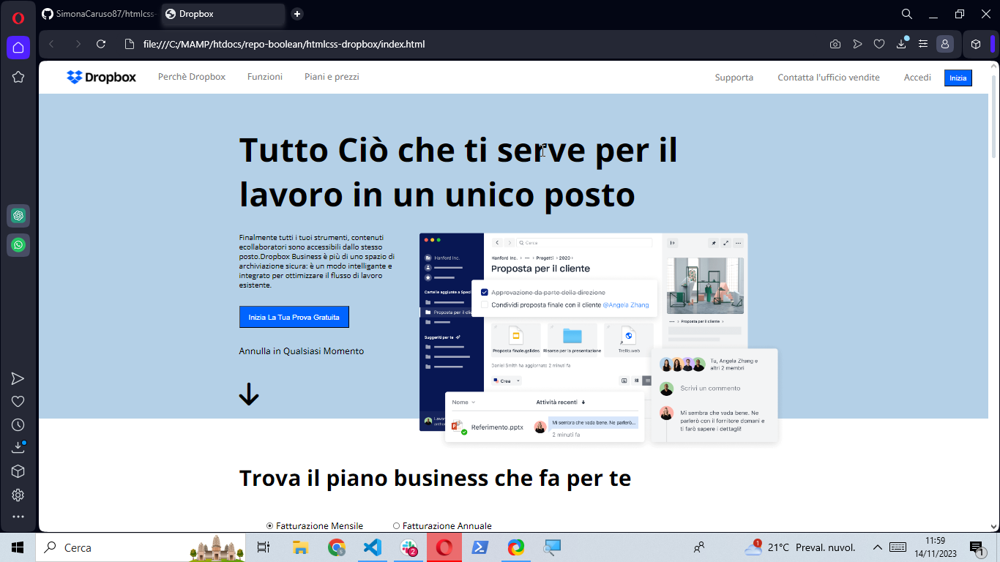
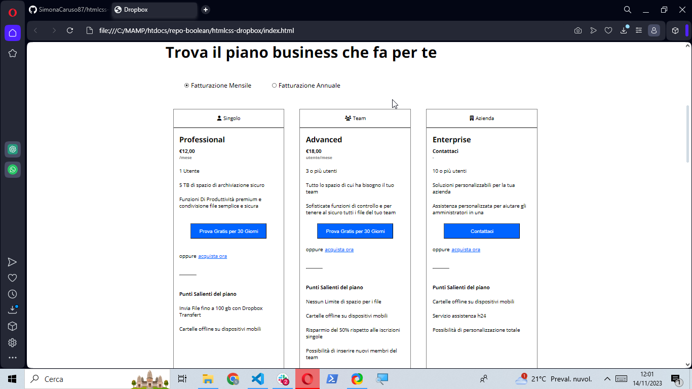
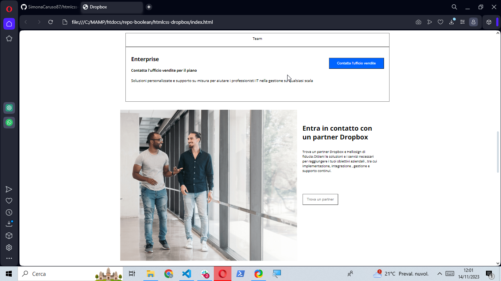
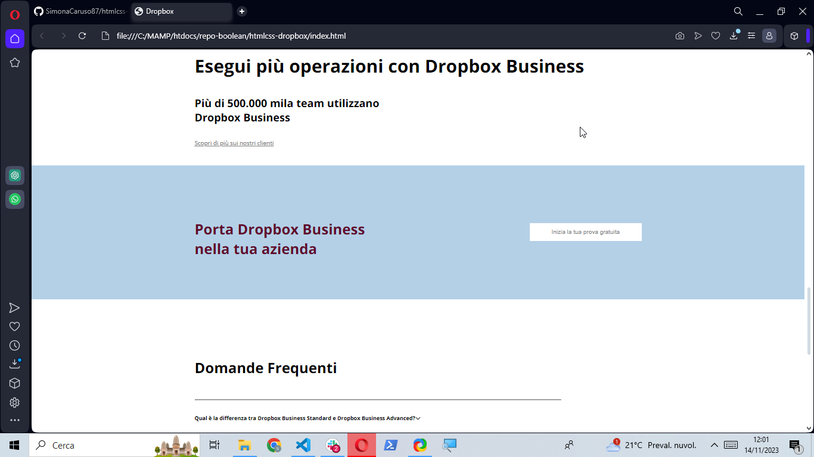
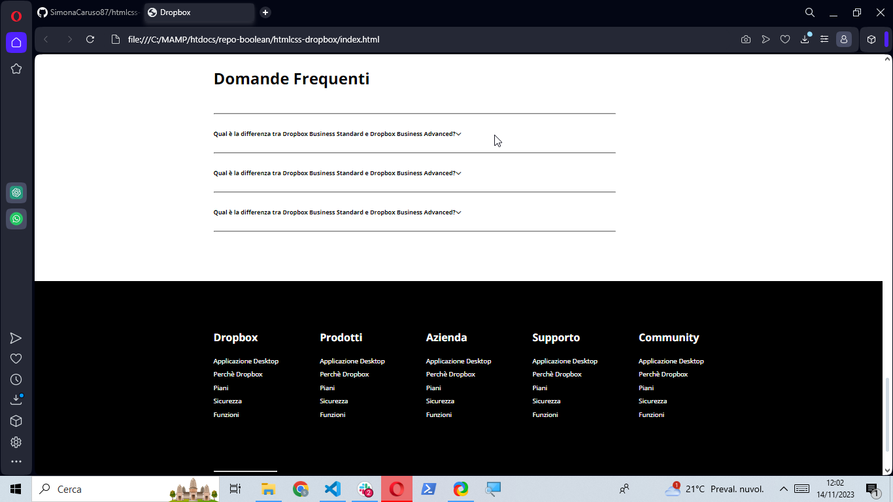

  
  <h2 align="center">Dropbox</h2>

 

### Demo Screeshots

# template-htmlcss-dropbox

Esercizio : Dropbox
cartella/repo: htmlcss-dropbox
Descrizione
Riproduciamo il layout come da screenshot (che rimane il nostro riferimento principale) cercando di essere il più fedeli possibili.
Analizziamo sempre prima il layout e scriviamo dei commenti per individuare le macroaree.
Facciamo un passo alla volta e puntiamo alla semplicità.
Consigli:
Teniamo sempre un approccio ordinato, solo quando tutto funziona passiamo al dettaglio, sezione per sezione. Cerchiamo però di bilanciare questo, organizzando il nostro tempo di sviluppo non incartandoci sulla singola feature, ma lasciando per dopo semmai i dettagli più complessi se è il caso.
Creiamo delle classi riutilizzabili individuando gli elementi ricorrenti nel layout, capendo quindi come e cosa possiamo centralizzare per rendere il nostro codice il più possibile semplice, pulito e quindi mantenibile.
Non lavoriamo ancora sul responsive, quindi la nostra pagina non deve adattarsi a tutti i possibili viewport. Se comunque riusciamo almeno a lavorare già un pò con unità relative, senza però crearci nuove difficoltà, tanto meglio.
